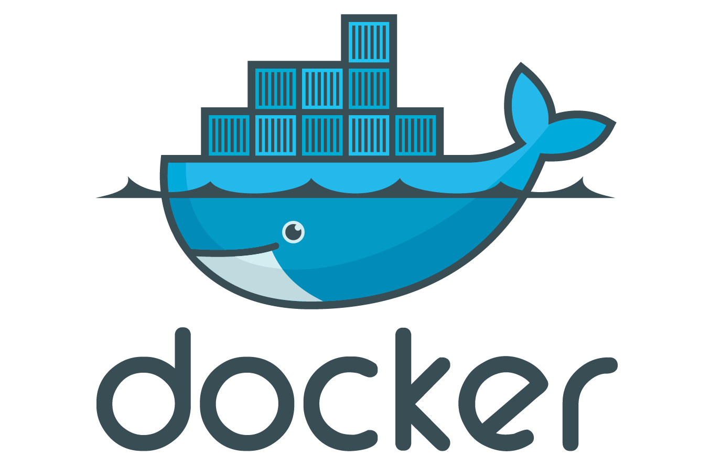

# 什么是Docker

---

## Docker基础概念

**
Docker可以在Liunx、Mac OS、Windows上运行，如果是在Liunx上运行，内核版本要在3.10以上
**

**
Docker是开源的「容器引擎」，Docker的出现解决了环境不一致的问题，Docker是和外部完全隔离的容器，任何服务
都可以在Docker中运行，并且无需考虑服务器环境对服务可能会造成的影响。Docker的核心思想是「build」、
「ship」、「run」，即构建、运输、运行。Docker的思想来自于集装箱，Docker将各种各样的货物被集装箱
标准化，集装箱之间不会相互影响。
**

**
在Docker官方提供的仓库中Docker Hub里提供了很多现在主流的一些服务的镜像，比如Nginx、Mysql、Redis等等，
我们可以直接将仓库中的镜像进行获取，在本机直接使用。当然，也可以根据自己的需求做定制化的镜像。就和下面的图
片里表达的一样，当我们需要的时候从仓库进行获取，我们定制化的东西经过构建完成，上传到仓库中去，即使是不同的
环境，我们可以随时随地的进行服务的运行。Docker提供了使用「Dockerfile」进行镜像的制作，「Docker Compose」
对多服务容器的「编排」。使用Docker，还可以降低对于环境部署的成本，比如对于微服务的部署，我们需要特别多的服务
实例，会占用大量的服务器资源，使用Docker，可以将实例放入Docker容器中，由于Docker容器中只提供对服务本身的
依赖支持，不会存在向虚拟机一样的大量操作系统文件，所以Docker的资源占用少，且性能高。Docker的出现解决了企业中
资源、环境的一大痛点。
**

## Docker资源

* Docker官方网站

[https://www.docker.com/](https://www.docker.com/)

* Docker官方文档

[https://docs.docker.com/engine/reference/run/](https://docs.docker.com/engine/reference/run/)

* Docker中文社区

[https://www.docker-cn.com/](https://www.docker-cn.com/)

* Docker网易蜂巢国内镜像站

[https://c.163yun.com/hub#/m/home/](https://c.163yun.com/hub#/m/home/)

* 慕课网

[https://www.imooc.com/learn/824](https://www.imooc.com/learn/824)

[https://www.imooc.com/learn/867](https://www.imooc.com/learn/867)