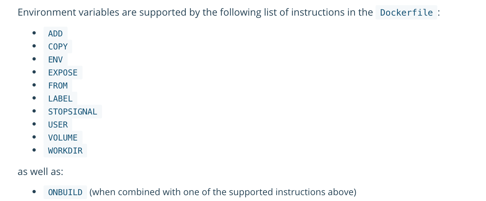

# Docker Dockerfile

---

**往往常用的一些镜像在Docker hub上或者其他的「镜像仓库」都有提供，但是在某种情况的时候我们需要自己进行镜像
的构建，比如，根据自己的特性化需求，或是根据工作中针对我们自己的Java(或者php、python等)服务使用Docker
进行「测试/生产」环境发布的时候，我们就需要去定制化构建自己的镜像**

## Dockerfile概述

**Dockerfile作为构建镜像的基础文件，Docker通过Dockerfile文件中的内容以及指定构建的工作目录进行Docker镜像
的制作**

**在本机指定目录中创建名称为Dockerfile的文件，文件中需要指定基础镜像「FROM」、镜像中运行指令的工作目录「WORKDIR」
环境变量「ENV」，也可以加上自己（维护人）的信息「MAINTAINER」，镜像的构建命令「RUN」，镜像运行完成之后需要的执行
命令「CMD」以及开放的端口「EXPOSE」等等信息**

## 基础文件

* Dockerfile文件

>Dockerfile文件是生成image的核心文件，里面指定所生成image的所有信息以及数据

* .dockerignore文件

>.dockerignore文件的性质和.gitignore文件性质是一样

>在构建Docker image的时候可以指定生成image的上下文目录中,哪些文件是需要被忽略掉的

## Dockerfile基本结构

* FROM

>指定基础image，也可以理解为此时构建的image要以什么image为基础

``` yml
FROM imageName:tag
```

* MAINTAINER

>维护人员信息

``` yml
MAINTAINER name email
```

* ENV 

>定义环境变量，在之后的一些指令中可以以变量的形式进行使用，使用方式：${port}或$port
>可以使用环境变量的指令：
>

``` yml
ENV port 80
```

* RUN

>在当前基础镜像中执行你输入的命令

``` yml
RUN apt-get -y install nginx
```

* WORKDIR

>接下来命令的工作目录，相当于cd

``` yml
WORKDIR /etc/nginx/conf.d
```

* COPY

>将宿主机文件copy至当前基础image目录

``` yml
COPY ./text.conf /etc/nginx/conf.d/
```

* VOLUME

>在执行docker run 的时候是可以指定挂载卷的，那么为什么在Dockerfile里还要有挂载卷的这个指令呢，
>如果我们在只是在Docker生成container的时候使用挂载卷的时候，只有指定了挂载卷目录生成的container
>才会有效，如果在Dockerfile进行指定的话，此image生成的容器都会生成一个挂载卷，不过宿主机上的挂载
>卷目录是docker指定的地址，和在使用docker run命令运行image生成container不指定本机挂载卷目录的
>效果是一样的「[Docker Volumes -> 不指定本机具体目录为挂载卷](docker4.md)」

``` yml
VOLUME /etc/nginx/config.d/
```

* CMD

>指定启动容器时执行的命令,每个 Dockerfile 只能有一条 CMD 命令。如果指定了多条命令,只有最后一条会被执行。
>如果用户启动容器时候指定了运行的命令,则会覆盖掉 CMD 指定的命令。

``` yml
CMD ["executable","param1","param2"]
```