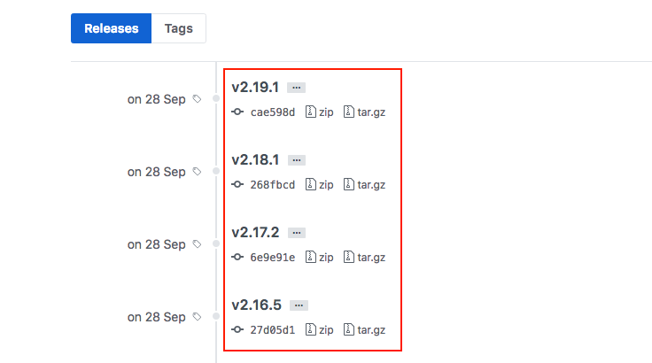
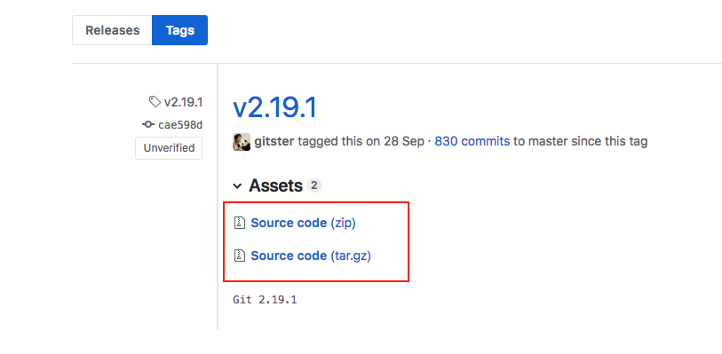
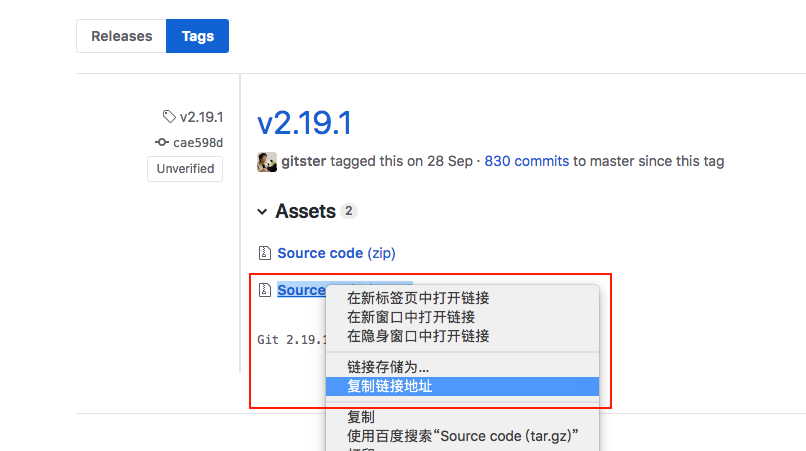

# 安装Git

---

## CentOS（源码安装）

* 下载Git，GitHub地址：[https://github.com/git/git/releases](https://github.com/git/git/releases)，选择版本后进行下载



* 选择压缩包



* 复制地址，使用wget进行下载



* 安装Git依赖库

```bash
$ sudo yum install curl-devel expat-devel gettext-devel \
  openssl-devel zlib-devel
```

```bash
$ sudo apt-get install libcurl4-gnutls-dev libexpat1-dev gettext \
  libz-dev libssl-dev
```

```bash
$ sudo yum install asciidoc xmlto docbook2x
```

```bash
$ sudo apt-get install asciidoc xmlto docbook2x
```

* 解压下载的压缩包，我下载的是.tar.gz格式的，如果你下载的是.zip格式的，使用unzip进行解压

> 解压.tar.gz

```bash
$ tar -zxf v2.19.1.tar.gz
```

> 解压.zip

```bash
$ unzip v2.19.1.zip
```

* 进入目录进行编译安装

```bash
$ cd v2.19.1
```

```bash
$ make configure
```

```bash
$ ./configure --prefix=/usr
```

```bash
$ make all doc info
```

```bash
$ sudo make install install-doc install-html install-info
```

> 如果在过程中出现异常 ：/bin/sh: autoconf: command not found，执行下面语句，然后继续进行安装过程

```bash
$ yum install install autoconf automake libtool
```